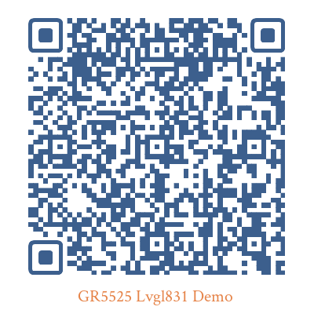

# GR5525-Smart-Watch

[EN](README.md)   |  [中文](README_zh.md)

## 1. Introduction

### 1.1 The Design

This is a  ref-design for Smart Watch Based On Goodix GR5525 BLE SoC, Supportting Lvgl_8.31 GUI Framework. Customers can get higher fps and enhanced performance for smart watch through the Chip's ability.

### 1.2 GR5525

The Goodix GR5525 family is a single-mode, low-power Bluetooth 5.3 System-on-Chip (SoC). 

it can be flexibly configured as a Broadcaster, an Observer, a Peripheral, or a Central. Moreover, it supports the flexible combination of all the above roles, making it an ideal choice for Internet of Things (IoT) and smart wearable devices.

Based on ARM® Cortex® -M4F CPU core, the GR5525 series integrates Bluetooth 5.3 Protocol Stack, a 2.4 GHz RF transceiver, on-chip programmable Flash memory, RAM, and multiple peripherals. It provides up to four I2C/UART interfaces, expands the I/O functionality, and enhances the QSPI interface, covering a wider range of IoT and wearable applications.

- Click [Me](https://www.goodix.com/en/product/connectivity/ble/gr5525) to view the GR5525 Introduction

## 2. Smart Watch

### 2.1 Ref Project 

The Ref Project is located at [projects/peripheral/graphics/gr5525_smart_watch](projects/peripheral/graphics/gr5525_smart_watch), It's compiled with Keil µVision5 in default.

### 2.2 Set UP the Development Environment

 To Set up the development environment, the following software is required:

- Keil µVision5: Integrated Development Environment (IDE) used by the Ref-Design project
- Device Family Pack (DFP) that supports ARM Cortex-M4 FPU Chip
- J-Link: programming and debugging tool 
- Serial port assistant tool: log printout
- GR5525 family chip programming algorithm file for Keil: you can find the .flm file in [build/keil](build/keil)

### 2.3 Hardware Related

- This Ref-Design is based on the GR5525 Starter Kit Board. you can find introduction to SK board here [GR5525_SK](https://www.goodix.com/en/kit/gr5525_starter_kit)
- Click  [GR5525_Diagram](https://www.goodix.com/en/docview/GR5525-SK-BASIC-RevB_Rev.1.0?objectId=218&objectType=document&version=390) to view the circuit diagram for GR5525 SK Board 

### 2.4 Software Related

- Ref-Design is based on GR5525 SDK v1.0.0

- GUI framework is optimized from Lvgl 8.31

### 2.5 Demo effect for Ref-Design 

- You can watch the Demo effect (More UI):

  - Click the web link : [Smart_Watch_Video](https://www.bilibili.com/video/BV1pA4m137hW/?vd_source=849be8d36cdf256cbd8e61ecdc3316ea)
  
  - Scan the following QRCode to view the video. 
  
     
